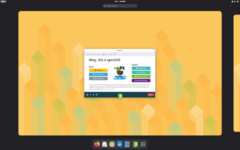
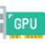
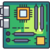

# Extra Credit 1: Markdown

## Document 1

## What is Linux?
Just like Windows, iOS, and Mac OS, Linux is an operating system. In fact, one of the most popular platforms on the planet, Android, is powered by the Linux operating system. An operating system is software that manages all of the hardware resources associated with your desktop or laptop. To put it simply, the operating system manages the communication between your software and your hardware. Without the operating system (OS), the software wouldn’t function.
1. Bootloader
2. Kernel
3. Init system

## Why use Linux?
This is the one question that most people ask. Why bother learning a completely different computing environment, when the operating system that ships with most desktops, laptops, and servers works just fine?

To answer that question, I would pose another question. Does that operating system you’re currently using really work “just fine”? Or, do you find yourself battling obstacles like viruses, malware, slow downs, crashes, costly repairs, and licensing fees?
If you struggle with the above, Linux might be the perfect platform for you. Linux has evolved into one of the most reliable computer ecosystems on the planet. Combine that reliability with zero cost of entry and you have the perfect solution for a desktop platform.
 
## Open source
Linux is also distributed under an open source license. Open source follows these key tenets:
+ The freedom to run the program,for any purpose.
+ Th freedom to study how the program works, and change it to make it do what you wish
  



| Name      | Version | Year Released |
| --------- | ------- | ------------- |
| Ubuntu    | 26.10   | 10-01-2026    |
| Open Suse | 16.1    | 09-28-2026    |


## Document 2
# Learn the Basic
## Hello, World!
How to print hello world
```python
print("hello world")
```
## Variables and Types
How to do Variables and Types
```python
myint = 7
print(myint)
```

## List
How to make a list
```python
mylist = []
mylist.append(1)
mylist.append(2)
mylist.append(3)
print(mylist[0]) # prints 1
print(mylist[1]) # prints 2
print(mylist[2]) # prints 3
```
## Basic Operator
How to input Basic Operator
```python
number = 1 + 2 * 3 / 4.0
print(number)
```
## String Operator
How to put String Operator
```python
# This prints out "Hello, John!"
name = "John"
print("Hello, %s!" % name)
```
## Basic String Operations
How to put Basic String Operations
```python
astring = "Hello world!"
astring2 = 'Hello world!'
```
## Conditions
```python
x = 2
print(x == 2) # prints out True
print(x == 3) # prints out False
print(x < 3) # prints out True
```
## Loops
```python
primes = [2, 3, 5, 7]
for prime in primes:
    print(prime)
```
## Document 3

## Table 1

| ID  | Name            | Email                   | Investment           |
| --- | --------------- | ----------------------- | -------------------- |
| 231 | Albert Master   | Albert.master@gmail.com | Bonds                |
| 210 | Alfred Alan     | aalan@gmail.com         | Stocks               |
| 256 | Alison Smart    | asmart@biztalk.com      | Residential Property |
| 211 | Ally Emery      | allye@easymail.com      | Stocks               |
| 248 | Andrew Phips    | andyp@mycorp.com        | Stocks               |
| 234 | Andy Mitchel    | andym@hotmail.com       | stocks               |
| 226 | Angus Robins    | arobins@robins.com      | Bonds                |
| 241 | ANn Melan       | ann_melan@iinet.com     | Residential Property |
| 225 | Ben Bessel      | benb@hotmail.com        | Stocks               |
| 235 | Bensen Romanolf | benr@albert.net         | Bonds                |

## Grade Distribution 

| Letter Grade | Percentage  |
| ------------ | ----------- |
| A            | 90 - 100%   |
| B            | 80 - 89.99% |
| C            | 70-79.99%   |
| D            | 60 -69.99%  |
| F            | <60%        |

| Part                     | Name          |
| ------------------------ | ------------- |
|    | Graphics Card |
|  | Hard Drive    |
|  | Motherboard   |
|  | RAM           |
